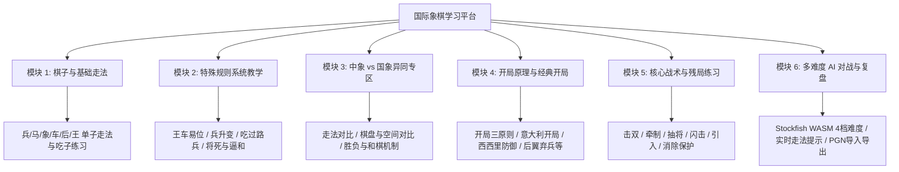

# 国际象棋学习网页（Chess Learning App）前期规划与架构设计文档

**文档版本**：v0.1.0  
**文档状态**：Ready for Review / Approved Baseline  
**目标定位**：面向中国象棋背景玩家的沉浸式、交互式国际象棋自主学习与对弈 Web 平台  
**运行环境**：本地轻量部署 / Tailscale 跨设备内网安全访问 / 纯前端 WASM 离线计算  

---

## 1. 项目概述与目标

### 1.1 项目背景与核心痛点
中国象棋（Xiangqi）在中国拥有深厚的用户基础。许多具备良好中国象棋棋理思维的玩家希望学习国际象棋（Chess），但在入门初期常面临以下痛点：
1. **概念迁移混淆**：国际象棋中的“马（Knight）”、“象（Bishop）”、“车（Rook）”、“兵（Pawn）”与中国象棋名称相似但规则与威力差异极大（例如马不蹩马腿、象可斜贯全盘、兵可升变与吃过路兵、将帅不限九宫格等）。
2. **特殊规则晦涩**：王车易位、兵的升变、吃过路兵、逼和（Stalemate）与长将判和等规则机制独特，若无可视化互动操作，极易产生规则盲区。
3. **缺乏渐进式人机梯级训练**：主流对战平台门槛高、计算依赖云端服务器或需要联网注册，初学者难以在低压力、即开即用、可回溯步法的私有环境中进行练习。
4. **多端访问繁琐**：个人本地开发环境需要通过 Tailscale 等私有组网工具在手机、平板或笔记本上随时随地无缝访问。

### 1.2 用户画像（User Persona）
* **姓名**：李明（化名）
* **棋类背景**：中国象棋业余进阶玩家，熟悉象棋的走子、布局与杀法，具备良好的大局观与计算意识。
* **学习诉求**：从零系统学习国际象棋，希望通过与中国象棋的对比快速建立规则映射，通过步法交互练习加深记忆，并能随时与不同段位 AI 进行复盘对战。
* **硬件与网络场景**：个人台式机作为主机常驻运行，通过 Tailscale 私有网在手机、iPad 或轻薄本上随时打开浏览器刷题、学棋与对局。

### 1.3 核心目标与指标
* **零后端依赖（Zero Backend）**：核心棋规判定与 AI 引擎全部在前端浏览器及 Web Worker/WASM 中本地运行，无需任何后端数据库或服务端计算支持。
* **渐进式交互教学（Interactive Pedagogy）**：告别纯图文说教，所有棋子走法、特殊规则与战术套路均配备“可上手走子的互动小棋盘”。
* **高效认知迁移（Cognitive Transfer）**：独创“中象 vs 国象”对比专题，利用象棋既有经验快速降维理解国象思维。
* **高响应与极简体验（Clean & Fast）**：页面即开即玩，操作流畅，适配移动端触控与桌面端键鼠。

---

## 2. 功能需求明细与交互设计



### 2.1 棋子走法与基础规则教学
每个棋子设独立教学关卡，采用“规则说明 -> 动态高亮演示 -> 交互目标闯关（如吃掉所有星星/目标子）”的三段式结构。

| 棋子 | 英文/代码 | 教学核心内容 | 交互式练习设计 |
| :--- | :--- | :--- | :--- |
| **兵 (Pawn)** | `P` / `p` | 只能向前、首步可走两格、斜前方一格吃子 | 放置散落金币，引导玩家单步移动与斜向吃子清盘 |
| **马 (Knight)** | `N` / `n` | "日"字形走法（2+1），全盘唯一可越子的棋子 | 放置多重障碍子，要求玩家跳过障碍精准抵达目标格 |
| **象 (Bishop)** | `B` / `b` | 斜向任意格，终生只能在单色格（白格象/黑格象） | 放置双色目标，体会双象分工与控制范围 |
| **车 (Rook)** | `R` / `r` | 横、竖直线任意格，控制开放线与通路 | 控制整行整列的吃子练习与封锁线建立 |
| **后 (Queen)** | `Q` / `q` | 车与象的合体（横、竖、斜任意格），全盘最强单兵 | 八皇后走法感知与多方向精准打击实操 |
| **王 (King)** | `K` / `k` | 周围 8 格每次走一格，核心中枢，不可走到被将军格 | 走位脱离威胁、保护己方子力的步法练习 |

### 2.2 国际象棋特殊规则教学
针对初学者最易困惑的特殊规则，设立专项解析与情景交互验证器：
1. **王车易位（Castling）**：
   * **条件教学**：王与车未曾移动、王与车之间无子阻隔、王当前未被将军、王穿越与到达的格子未受攻击。
   * **王翼易位（短易位 0-0） vs 后翼易位（长易位 0-0-0）** 的步法演练。
2. **兵的升变（Pawn Promotion）**：
   * 兵抵达底线（第 8 横线/第 1 横线）时即刻升变为后、车、马、象（弹出可视化升变选择模态框）。
   * 演示并练习“升变”反败为胜的经典残局。
3. **吃过路兵（En Passant）**：
   * 对手兵首步走两格越过己方兵攻击格时，己方可在**紧接着的下一步**将其当作只走一格进行斜向截击吃掉。
   * 限制提示：必须在对方走完两格兵的立即下一步执行，延后失效。
4. **将军（Check）、应将（Parrying Check）与将死（Checkmate）**：
   * 三种应将方式：消灭攻击子（Capture）、阻挡攻击线（Block）、王逃移安全格（Evade）。
   * 无法应将即为将死，游戏胜负判定。
5. **和棋（Draw）与逼和（Stalemate）**：
   * **逼和（Stalemate）**：轮到走棋一方**未被将军**，但全盘**无任何合法着法**，判为和棋（重点强调与中象“困毙判负”的区别）。
   * **其他和棋**：三次重复局面、50步规则、子力不足（双王、王单马、王单象无法形成将死）。

### 2.3 “中国象棋 vs 国际象棋” 异同对比专区（特色亮点）
为中国象棋玩家专门定制横向对照模块，建立思维认知网桥：

```
+---------------------------------------------------------------------------------------+
|                              中象 vs 国象 核心规则与棋理对照表                          |
+-------------------+----------------------------------+--------------------------------+
| 比较维度          | 中国象棋 (Xiangqi)               | 国际象棋 (Chess)               |
+-------------------+----------------------------------+--------------------------------+
| 棋盘规格与结构    | 9x10=90个交叉点，含九宫格与楚河汉界 | 8x8=64个黑白相间方格，无边界阻隔 |
| 棋子放置位置      | 放置在网格“交叉点”上             | 放置在方格“格子内”             |
| 马 (Knight) 走法  | 走“日”字，受“蹩马腿”规则限制     | 走“日”字，无蹩马腿，可任意越子   |
| 象 (Bishop) 走法  | 走“田”字，受“塞象眼”限制，不过河 | 斜行无格数限制，无塞象眼，贯穿全盘 |
| 车 (Rook) 走法    | 横平竖直，开局需出车             | 横平竖直，可与王进行“王车易位”   |
| 兵 (Pawn) 威力    | 步步向前，过河后可左右横走，不升变 | 初始可走两步，斜吃直进，底线升变 |
| 帅/将 (King) 权限 | 困于九宫格内，两将不可照面       | 全盘任意漫游，不可送吃，可易位保护 |
| 最强子力对比      | 炮（需炮架，隔子吃子）/ 车       | 后（车象结合，横竖斜全能制霸）   |
| 困毙/无子可动判定 | 轮到走棋无合法步者——【判负】     | 轮到走棋无合法步者且未受照——【和棋】|
| 杀王理念          | 调动子力隔空围剿，破仕相杀九宫   | 争夺中心、开放线，全盘多兵种协同围王 |
+-------------------+----------------------------------+--------------------------------+
```

### 2.4 开局原则与经典开局库
* **开局三大黄金原则**：
  1. 争夺与控制中心格子（e4, d4, e5, d5）；
  2. 快速出动轻子（马和象先行），避免同一子反复移动；
  3. 尽早王车易位确保王的安全，连通双车。
* **经典开局分类与互动演练**：
  * **开放性开局 (1.e4 e5)**：意大利开局（Italian Game）、西班牙开局（Ruy Lopez）、苏格兰开局（Scotch Game）。
  * **半开放性开局 (1.e4 others)**：西西里防御（Sicilian Defense - 1...c5）、法兰西防御（French Defense - 1...e6）、卡罗·康防御（Caro-Kann - 1...c6）。
  * **封闭性开局 (1.d4 d5)**：后翼弃兵（Queen's Gambit）、斯拉夫防御（Slav Defense）。
  * **印度防御体系 (1.d4 Nf6)**：王翼印度防御（King's Indian Defense）、尼姆佐维奇防御（Nimzo-Indian Defense）。
* **开局树分支查看器**：逐步指引走棋，每步附带战略意图讲解与“为什么不走其他步”的误区解析。

### 2.5 基础战术套路与互动解谜
设置 50+ 道精选典型残局与战术题，分为 6 大核心战术主题：
1. **击双（Fork / 双重打击）**：马与兵最具代表性的多点打击。
2. **牵制（Pin）**：绝对牵制（后方是王，被牵制子不可移动）与相对牵制（后方是后或车，移动将承受更大损失）。
3. **抽将（Discovered Check / 闪击将）**：移开前置子力的同时后方子力发起将军，前置子借机吃子。
4. **闪击（Discovered Attack）**：移开阻挡线子力形成多重攻击威胁。
5. **串击/穿透（Skewer）**：高价值子（如王或后）受攻击被迫移开，露出后方低价值子被吃。
6. **消除保护与引入（Remove Defender & Decoy）**：破除防守链条的组合杀法。

### 2.6 多难度 Stockfish 人机对战与实时评估
1. **4 档预设 AI 难度**：
   * **入门（Beginner - Elo ~800）**：限制搜索深度（Depth 1~2），加入随机容错，适合刚刚学完走子的初学者培养杀王自信。
   * **初级（Novice - Elo ~1200）**：搜索深度 4~6，掌握基本开局与简单战术，无明显无脑漏子。
   * **中级（Intermediate - Elo ~1600）**：搜索深度 8~10，具备坚固阵型与防守反击能力。
   * **高级（Advanced - Elo ~2000+）**：搜索深度 14+ / 使用 Skill Level 20，精准计算杀法与局面压制。
2. **对弈辅助工具箱**：
   * **实时局面优势评估条（Evaluation Bar）**：显示当前白方/黑方分值优势（如 `+1.8` / `-0.5` / `#M3` 即三步将死）。
   * **悔棋（Undo Move）与重新开始（Restart）**。
   * **走法提示（Hint）**：调用引擎分析最佳着法（Best Move）并在棋盘绘制高亮箭头。
   * **PGN 棋谱记录与 FEN 局势导入/导出**：支持复制 PGN/FEN 字符串，便于分享复盘。
   * **翻转棋盘（Flip Board）**：支持随时切换执白（先手）或执黑（后手）视角。

### 2.7 页面结构与信息架构（IA）
单页应用（SPA）多视图架构，采用顶部精简导航栏与主内容区：
* **首页 / 仪表盘 (`/`)**：学习路径总览、中象玩家欢迎引导、快捷进入对战与每日一题。
* **规则基石 (`/rules`)**：棋子走法子路由 (`/rules/pieces`)、特殊规则子路由 (`/rules/specials`)。
* **中象对比 (`/comparison`)**：对照知识卡片、常见易犯错误避坑指南、对照专项练习。
* **战术题库 (`/tactics`)**：战术分类浏览、解谜模式（成功/失败即时反馈、步法提示）。
* **开局大全 (`/openings`)**：开局分类谱系树、走法跟随演示。
* **人机对弈 (`/play`)**：全功能对弈棋盘、难度调节、评估条、对局记录面板、PGN/FEN 工具箱。
* **设置中心 (`/settings`)**：棋盘样式切换（经典木纹/石板蓝/森林绿）、音效开关、动画速度调节。

---

## 3. 文件与代码目录结构规划

项目严格遵循模块化、高内聚低耦合原则，目录与文件名统一使用 `snake_case`，通用库/配置使用常见规范缩写（`lib/`, `cfg/`, `prj/`, `docs/`）。

```
chess_learning_prj/
├── docs/                                  # 项目规划与技术设计文档
│   └── plan-v0.1.0.md                     # 本前期规划文档
├── public/                                # 静态资源目录（不经打包工具转译）
│   ├── favicon.svg                        # 网站图标（SVG）
│   ├── engine/                            # Stockfish WASM 引擎本地包
│   │   ├── stockfish.js                   # Stockfish Web Worker 包装入口
│   │   ├── stockfish.wasm                 # Stockfish 18 WASM 二进制核心
│   │   └── stockfish.worker.js            # Worker 线程调度脚本
│   ├── audio/                             # 棋子落子、吃子、将军、和棋音效
│   │   ├── move.mp3                       # 普通走子音效
│   │   ├── capture.mp3                    # 吃子音效
│   │   ├── check.mp3                      # 将军提示音
│   │   └── game_end.mp3                   # 对局结束音效
│   └── assets/
│       └── pieces/                        # 官方标准 cburnett 矢量棋子 SVG
│           ├── wP.svg                     # 白兵
│           ├── wN.svg                     # 白马
│           ├── wB.svg                     # 白象
│           ├── wR.svg                     # 白车
│           ├── wQ.svg                     # 白后
│           ├── wK.svg                     # 白王
│           ├── bP.svg                     # 黑兵
│           ├── bN.svg                     # 黑马
│           ├── bB.svg                     # 黑象
│           ├── bR.svg                     # 黑车
│           ├── bQ.svg                     # 黑后
│           └── bK.svg                     # 黑王
├── src/                                   # 前端核心源码
│   ├── index.html                         # SPA 唯一 HTML 模版入口
│   ├── main.ts                            # 应用入口：挂载路由、初始化全局状态
│   ├── styles/                            # 全局与组件样式表（Editorial 风格）
│   │   ├── tokens.css                     # 色彩、字体、阴影、栅格 Design Tokens
│   │   ├── reset.css                      # 样式重置与盒模型基线
│   │   ├── layout.css                     # 页面主体布局、Header、双栏网格系统
│   │   ├── chessground.css                # 棋盘 UI 自定义皮肤与动画覆盖
│   │   └── components.css                 # 卡片、按钮、徽章、模态框标准组件样式
│   ├── lib/                               # 第三方库封装与适配器
│   │   ├── chess_engine.ts                # chess.js 规则封装（走法验证/FEN/PGN解析）
│   │   ├── stockfish_worker.ts            # Stockfish UCI 协议通信调度封装
│   │   ├── board_adapter.ts               # @lichess-org/chessground 适配器与事件绑定
│   │   └── sound_player.ts                # Web Audio API 音效管理器
│   ├── data/                              # 教学与战术静态题库数据
│   │   ├── piece_lessons.json             # 6大棋子基础教学关卡数据
│   │   ├── special_rules.json             # 易位/升变/过路兵等特殊规则教学情景
│   │   ├── xiangqi_comparison.json        # 中象 vs 国象对照核心数据与测试用例
│   │   ├── opening_book.json              # 经典开局分支谱与中文解析
│   │   └── tactics_puzzles.json           # 击双/牵制/闪击等分类战术精选题库
│   ├── modules/                           # 核心功能业务模块
│   │   ├── navigation/                    # 顶部导航与移动端抽屉
│   │   │   └── nav_bar.ts
│   │   ├── lesson_viewer/                 # 交互式规则与棋子教学视图
│   │   │   ├── lesson_controller.ts
│   │   │   └── lesson_ui.ts
│   │   ├── comparison_viewer/             # 中象 vs 国象对照专区视图
│   │   │   ├── comparison_controller.ts
│   │   │   └── comparison_ui.ts
│   │   ├── tactic_trainer/                # 战术解谜训练营
│   │   │   ├── puzzle_controller.ts
│   │   │   └── puzzle_ui.ts
│   │   ├── opening_explorer/              # 经典开局探索器
│   │   │   ├── opening_controller.ts
│   │   │   └── opening_ui.ts
│   │   └── game_play/                     # 人机对弈主模块
│   │       ├── game_controller.ts         # 对弈主逻辑（轮次/倒计时/难度/提示）
│   │       ├── eval_bar_ui.ts             # 实时局势优势评估条 UI
│   │       ├── move_history_ui.ts         # 走法着法表（SAN 格式）与导航
│   │       ├── promotion_modal_ui.ts      # 兵升变选择弹窗
│   │       └── game_ui.ts                 # 对弈工作台整体编排
│   ├── utils/                             # 通用工具函数
│   │   ├── uci_parser.ts                  # Stockfish UCI 输出解析（分值/推荐步/深度）
│   │   ├── pgn_formatter.ts               # PGN 文本格式化与导出
│   │   └── dom_builder.ts                 # 极简 DOM 构建与事件安全绑定小工具
│   └── types/                             # 全局 TypeScript 类型定义
│       ├── chess_types.ts                 # 棋局状态、FEN、走法类型
│       ├── lesson_types.ts                # 教程步、提示与通关判定类型
│       └── engine_types.ts                # Stockfish 参数、评估数据结构
├── package.json                           # 依赖声明与 npm scripts
├── tsconfig.json                          # TypeScript 编译器配置
├── vite.config.ts                         # Vite 构建配置（支持多线程与本地服务）
└── .gitignore                             # Git 忽略配置
```

---

## 4. 技术选型与第三方依赖调研

为了实现**无需后端、零冗余、低门槛本地运行**的极简架构，技术栈经过严格调研，全部选用国际象棋开源社区经过数亿次实战检验的高星、工业级成品库。

### 4.1 核心选型与理由说明

```
+-------------------------------------------------------------------------------------------------------------------------+
|                                              核心技术选型一览表                                                           |
+----------------------+--------------------+---------------+------------------+------------------------------------------+
| 类别                 | 库 / 依赖名称       | 调研最新版本  | 引入方式         | 选型理由与技术优势                       |
+----------------------+--------------------+---------------+------------------+------------------------------------------+
| 棋规与合法性逻辑     | chess.js           | v1.4.0        | npm 依赖本地编译 | 全球事实标准的 JS 棋规库，内置完整 TS    |
|                      |                    |               |                  | 类型，准确验证合法着法/FEN/PGN/和棋状态  |
+----------------------+--------------------+---------------+------------------+------------------------------------------+
| 棋盘 UI 与交互库     | @lichess-org/      | v10.1.1       | npm 依赖本地编译 | Lichess.org 官方开源棋盘核心，零外部依赖 |
|                      | chessground        |               |                  | 极致流畅的拖拽/点击交互与移动端触控优化  |
+----------------------+--------------------+---------------+------------------+------------------------------------------+
| AI 对战与局势分析    | stockfish.js       | Stockfish 18  | 本地静态 public/ | 世界上最强开源国象引擎编译为 WASM，支持   |
|                      | (Stockfish WASM)   | (WASM Build)  | Web Worker 异步  | UCI 协议，纯本地无延时并发计算           |
+----------------------+--------------------+---------------+------------------+------------------------------------------+
| 矢量棋子素材         | Lichess cburnett   | Standard SVG  | 静态资源 (SVG)   | 国际象棋领域公认最清晰、辨识度最高矢量图 |
+----------------------+--------------------+---------------+------------------+------------------------------------------+
| UI 矢量图标库        | lucide (lucide-static)| v1.33.0     | npm 依赖编译     | 统一风格的极简线性 SVG 图标，全面替代    |
|                      |                    |               |                  | emoji，兼顾高可读性与专业排版质感        |
+----------------------+--------------------+---------------+------------------+------------------------------------------+
| 构建系统与开发服务   | Vite               | v6.x          | npm (Dev)        | 秒级热重载、极小产物体积、开箱即用 TS    |
+----------------------+--------------------+---------------+------------------+------------------------------------------+
```

### 4.2 各核心库详细集成机制

#### 1. 棋局逻辑库：`chess.js` (v1.4.0)
* **核心职责**：管理整盘棋的状态机（FEN）、验证玩家走的每一步是否符合国际象棋规则（含王车易位、吃过路兵、升变合法性）、生成当前所有合法着法（`moves({ verbose: true })`）、判断将军（`inCheck()`）、将死（`isCheckmate()`）、逼和（`isStalemate()`）、三次重复局面与50步和棋。
* **集成机制**：
  ```typescript
  import { Chess } from 'chess.js';
  const game = new Chess();
  // 走棋验证与状态流转
  const moveResult = game.move({ from: 'e2', to: 'e4' });
  ```

#### 2. 棋盘 UI 渲染与交互：`@lichess-org/chessground` (v10.1.1)
* **核心职责**：负责 DOM 渲染、64 格方阵布局、棋子拖拽与点击放置动画、高亮上一着法格子、高亮当前被选棋子的所有合法落点、在棋盘上绘制战术提示箭头/标记圆圈。
* **集成机制**：
  ```typescript
  import { Chessground } from 'chessground';
  const ground = Chessground(document.getElementById('board-container')!, {
    fen: game.fen(),
    orientation: 'white',
    turnColor: 'white',
    movable: {
      free: false,
      color: 'white',
      dests: getLegalDests(game) // 将 chess.js 的合法着法映射至 Chessground
    },
    events: {
      move: (orig, dest) => onUserMove(orig, dest)
    }
  });
  ```

#### 3. AI 对战引擎：Stockfish 18 (WASM + Web Worker)
* **核心职责**：在后台独立线程中运行，通过标准 UCI (Universal Chess Interface) 指令与主线程双向通信，负责计算推荐步与局势估分。
* **通信协议交互范例**：
  ```typescript
  // 主线程发送指令
  worker.postMessage('uci');
  worker.postMessage('setoption name Skill Level value 5'); // 难度等级控制 (0-20)
  worker.postMessage(`position fen ${currentFen}`);
  worker.postMessage('go depth 8'); // 限制搜索深度

  // Worker 返回解析
  worker.onmessage = (e) => {
    const line = e.data;
    if (line.startsWith('info depth') && line.includes('score cp')) {
      // 提取评估分 (Centipawns) -> 转换并更新评估条 UI
    } else if (line.startsWith('bestmove')) {
      const bestMove = line.split(' ')[1]; // 例如 "e7e5"
      // 执行 AI 走子
    }
  };
  ```

#### 4. 图标系统：Lucide Icons (v1.33.0)
* **设计原则**：严格**禁止在 UI 中使用 Emoji**（Emoji 跨平台渲染风格不一，缺乏严谨智力博弈软件的高级感）。全站统一采用 Lucide 矢量 SVG 线性图标，保持 1.5px/2px 描边一致性与色板主题适配。

---

## 5. UI 设计规范（基于 StyleKit "Editorial" 风格）

经过调研 StyleKit 视觉风格库（https://www.stylekit.top/zh/styles），本项目选定 **`Editorial`（编辑杂志风）** 作为全站核心设计语言。

```
+---------------------------------------------------------------------------------------------------+
|                                 StyleKit "Editorial" 风格视觉特征                                  |
|                                                                                                   |
|  [ 优雅衬线标题 ]  Serif Titles + Sans-serif Body + Monospace PGN Notation                        |
|  [ 纸张与木质色 ]  Warm Parchment (#F9F8F6) + Oxford Blue (#14213D) + Antique Gold (#C29B38)       |
|  [ 严谨网格间距 ]  4px/8px 严格基线，卡片采用细线边框 (1px Border)，克制低沉微阴影                 |
|  [ 严谨无 Emoji ]  100% 统一使用 Lucide 矢量 SVG 图标，保持学术与智力博弈的专业质感                |
+---------------------------------------------------------------------------------------------------+
```

### 5.1 选定理由
1. **契合棋类文化沉淀**：国际象棋与中国象棋均拥有上千年的历史底蕴，`Editorial` 风格独特的衬线字体、经典墨黑、羊皮纸暖白与胡桃木色调，能够传递出沉稳、专注、典雅的书卷气与博弈氛围。
2. **深度长文与棋谱可读性**：学习类网页包含大量规则解析、战术原理解析与 PGN 走法记号，`Editorial` 对字偶间距、行高、留白有极高规范要求，能有效降低长时间学习的眼部疲劳感。
3. **突出棋盘主体**：低噪点、克制装饰的界面使得棋盘与棋子成为视觉中心，不会被花哨的渐变或浮夸动效干扰计算思考。

### 5.2 色彩系统（Color Design Tokens）

```css
:root {
  /* 基础背景与纸张色 */
  --bg-app: #F9F8F6;               /* 羊皮纸暖白底色 */
  --bg-surface: #FFFFFF;           /* 内容卡片纯白 */
  --bg-surface-subtle: #F3F1ED;    /* 次级卡片与控制区底色 */
  --bg-sidebar: #101826;           /* 深色侧边/顶栏底色 */

  /* 品牌主色与点缀色 */
  --color-primary: #14213D;        /* 牛津暗蓝（主要文字/核心按钮） */
  --color-accent: #C29B38;         /* 典雅复古金（高亮/选中/徽章/胜利提示） */
  --color-accent-hover: #A8832A;   /* 金色悬停 */
  --color-danger: #9E2A2B;         /* 枣红（将军危险/错误走法提示） */
  --color-success: #2B7A4B;        /* 松石绿（走法正确/战术通过） */

  /* 文字色阶 */
  --text-main: #1C1917;            /* 正文主文字（极深暖灰炭黑） */
  --text-muted: #57534E;           /* 次级说明文字 */
  --text-tertiary: #8C8883;        /* 辅助/占位文字 */
  --text-inverse: #FFFFFF;         /* 反色白字 */

  /* 边框与分割线 */
  --border-light: #E7E5E0;         /* 卡片柔和边框 */
  --border-strong: #1C1917;        /* 强调边框（Editorial 特色 1.5px 实线） */

  /* 国际象棋棋盘标准色 */
  --board-light-sq: #F0D9B5;       /* 浅色格（枫木乳白） */
  --board-dark-sq: #B58863;        /* 深色格（胡桃木棕） */
  --board-highlight: rgba(20, 33, 61, 0.4); /* 走法目标点圆点 */
  --board-last-move: rgba(194, 155, 56, 0.45); /* 上一步格子高亮 */
}
```

### 5.3 字体排印规范（Typography）
* **大标题 / 模块标题（Header / Titles）**：
  * 英文字体：`"Playfair Display", "Cinzel", "Georgia", serif`
  * 中文字体：`"Songti SC", "Noto Serif SC", "Source Han Serif SC", "SimSun", serif`
  * 字重：`600` / `700`，行高 `1.2`，微拉大字间距（`letter-spacing: 0.02em`）。
* **正文与说明（Body Text）**：
  * 字体：`-apple-system, BlinkMacSystemFont, "Segoe UI", "PingFang SC", "Hiragino Sans GB", "Microsoft YaHei", sans-serif`
  * 字号：`15px` / `16px`，行高 `1.6`，字重 `400`。
* **棋谱记号与代数符号（PGN Notation / Coordinates）**：
  * 字体：`"JetBrains Mono", "SF Mono", "Consolas", monospace`
  * 确保数字等宽对齐，便于走法列表排版。

### 5.4 间距与 12 栏响应式栅格规范
* **基础间距倍数**：基于 `4px` 乘数体系（`4px`, `8px`, `12px`, `16px`, `24px`, `32px`, `48px`, `64px`）。
* **栅格与响应式断点**：
  * **桌面端（≥ 1024px）**：双栏主从布局（左侧 65% 主棋盘视窗 + 右侧 35% 教学/对弈交互工作台，最大宽度 `1280px` 居中）。
  * **平板端（768px ~ 1023px）**：棋盘保持方形自适应居中，下方排列操作面板。
  * **移动端（< 768px）**：单列纵向流式排版，棋盘宽度占屏幕 `94vw`，下方采用手风琴式 Tab 折叠面板，优化单手触控。

### 5.5 组件设计规范
1. **Editorial 教学卡片**：
   * 采用 `1px solid var(--border-light)` 搭配 `4px` 微圆角（严禁大圆角卡片，保持书卷报刊感）。
   * 顶部带有典雅的分类小标（如 `01 / 棋子基础`），全大写 + `letter-spacing: 0.1em`。
2. **操作按钮（Buttons）**：
   * 主按钮：深墨蓝底色 + 白色文字 + `border: 1px solid var(--color-primary)`，点击时微下沉效果。
   * 次级按钮：白色底色 + 深墨蓝边框与文字。
   * 战术提示按钮：淡金边框 + 金色图标。
3. **局势评估条（Evaluation Bar）**：
   * 纵向细长条（宽度 `12px`），贴合在棋盘左侧，白色与黑色双色填充高度随分值平滑渐变过渡。
4. **着法历史表（Move History Table）**：
   * 双列网格排版（序号、白方、黑方），当前步以浅金色高亮标注，支持点击任意历史步让棋盘瞬间回退重现。

---

## 6. 开发步骤与实施里程碑

本项目采用分阶段敏捷迭代，每个步骤都有明确的产出物和可检验的验收准则。

```
[步骤 0: 规划文档 (本阶段)]
       │
       ▼
[步骤 1: 骨架工程与基础架构] ──► 搭建 Vite+TS 项目、集成 CSS Tokens、引入静态资源
       │
       ▼
[步骤 2: 棋盘与规则逻辑引擎适配] ──► 封装 chess.js 与 chessground，实现可走子空棋盘
       │
       ▼
[步骤 3: 棋子与特殊规则互动教学] ──► 编写 6 大棋子与 4 大特殊规则关卡与判定器
       │
       ▼
[步骤 4: 中象 vs 国象对照专区] ──► 制作对照卡片、动态演示与走法避坑测验
       │
       ▼
[步骤 5: 战术训练与开局库] ──► 实现 50+ 战术解谜互动与经典开局分支浏览器
       │
       ▼
[步骤 6: Stockfish 人机对战] ──► 接入 WASM Worker、评估条、多难度与 PGN 工具
       │
       ▼
[步骤 7: 跨端适配、Tailscale 联调与交付] ──► 响应式优化、音效合成、内网远程全功能验收
```

### 详细里程碑规划表

| 步骤编号 | 阶段名称 | 核心开发任务 | 交付物 (Deliverables) | 阶段验收标准 |
| :--- | :--- | :--- | :--- | :--- |
| **Step 0** | **前期规划** | 需求梳理、技术选型、UI 规范定制、编写规划书 | `docs/plan-v0.1.0.md` | 文档涵盖所有 7 大章节，逻辑闭环，架构严谨 |
| **Step 1** | **骨架搭建** | 初始化 Vite + TS 工程，配置 tokens/reset 样式，集成 SVG 棋子与 Lucide 图标 | 基础运行工程、SPA 路由框架、响应式布局外壳 | 页面可正常启动，Header/导航可切换，无样式错乱 |
| **Step 2** | **核心引擎适配** | 封装 `chess.js` 与 `chessground` 适配器，处理合法走法生成、FEN 同步与音效触发 | `chess_engine.ts`、`board_adapter.ts`、可交互棋盘组件 | 棋盘上可拖拽走子，严格拦截非法步，走子与吃子有音效 |
| **Step 3** | **规则教学模块** | 实现 6 大单子走法练习与 4 大特殊规则（易位、升变、过路兵、逼和）可视化关卡 | `/rules` 视图、升变弹窗组件、教学关卡 JSON 数据 | 每个关卡有明确目标，走对自动通关，走错有提示 |
| **Step 4** | **中象对照专区** | 制作 8 项核心规则对比图表与“中象思维迁移”实战模拟小测试 | `/comparison` 视图、对比卡片组件、陷阱纠错题库 | 对照内容准确清晰，点击“模拟对比”可直观体验马/象差异 |
| **Step 5** | **开局与战术模块** | 开发战术解谜界面（击双/牵制等）与经典开局谱系浏览器 | `/tactics` 视图、`/openings` 视图、50+ 题库数据 | 解谜支持单步验证、最佳防守反击与提示；开局支持逐步演绎 |
| **Step 6** | **Stockfish 对战** | 引入 Stockfish 18 WASM Worker，实现 4 档难度、局势评估条、悔棋、复盘 | `/play` 视图、`stockfish_worker.ts`、评估条组件 | AI 能在 1 秒内响应走子，难度梯度明显，评估条准确更新 |
| **Step 7** | **调优与远程验证** | 移动端触控优化、PWA 离线支持、Tailscale 远程跨设备实机测试与联调 | 最终交付 Web 应用、优化报告 | 在手机/iPad 上通过 Tailscale IP 完美流畅运行 |

---

## 7. 验收标准（DoD - Definition of Done）

对项目最终交付成品的完整验收清单：

### 7.1 教学与战术功能验收
- [ ] **棋子教学完整性**：兵、马、象、车、后、王 6 种棋子均具备独立的规则说明、攻击范围高亮与互动练习关卡。
- [ ] **特殊规则覆盖度**：
  - [ ] 王车易位：短易位与长易位判定精准，受攻击或穿越攻击格时严格禁止易位。
  - [ ] 兵升变：兵到底线即刻触发选择弹窗，支持升变为后、车、马、象，且升变后子力属性立即生效。
  - [ ] 吃过路兵：符合条件时精准高亮目标格，非紧邻下一步时过路兵权利自动作废。
  - [ ] 胜负与和棋：准确判定将死（Checkmate）、逼和（Stalemate）、三次重复局面与 50 步规则。
- [ ] **中象对比专区**：至少包含 8 个核心维度的中象 vs 国象异同对照，配有生动的走法差异演示。
- [ ] **战术解谜训练**：包含击双、牵制、抽将、闪击等典型主题，题目作答时具备实时对错反馈与重试机制。
- [ ] **开局库浏览**：收录至少 6 种经典主流开局（意大利、西班牙、西西里、后翼弃兵等），支持分支着法逐步演示。

### 7.2 棋盘交互与人机对战验收
- [ ] **棋盘操作手感**：支持“拖拽落子”与“点击选子 -> 点击落点”两种交互方式，落子吸附准确，合法点高亮清晰。
- [ ] **Stockfish 引擎对战**：
  - [ ] 纯前端离线计算，不发起任何外网 API 请求。
  - [ ] 4 档难度（入门/初级/中级/高级）区分明显，低难度有拟人化容错，高难度计算严密。
  - [ ] 局势评估条随盘面走法实时更新，支持优势方数值（如 `+2.4`）与将死步数提示（如 `#3`）。
  - [ ] 支持悔棋、重新开始、切换执黑/执白（翻转棋盘）、获取 AI 走法提示。
  - [ ] PGN 文本导入与导出功能完全符合国际标准 PGN 规范。

### 7.3 视觉与 UI 规范验收
- [ ] **风格一致性**：严格贯彻 StyleKit `Editorial` 风格，配色、字体层级、边框线与卡片质感全站统一。
- [ ] **全站禁止 Emoji**：所有界面操作、提示、图标均使用 Lucide 矢量 SVG，严禁任何操作系统原生 Emoji 混入。
- [ ] **音效反馈**：走子、吃子、将军、对局结束均配备舒适悦耳的 Web Audio 音效，且支持一键静音。

### 7.4 性能、兼容性与 Tailscale 远程访问验收
- [ ] **无控制台报错**：正常使用过程中 Chrome/Firefox/Safari 控制台 0 Error、0 Uncaught Exception。
- [ ] **Tailscale 访问体验**：通过 Tailscale 局域私网 IP（如 `http://100.x.y.z:5173`）在手机与平板端浏览器打开，首屏秒开，触控操作无双击缩放冲突，棋盘大小自适应屏幕。
- [ ] **资源本地化**：所有 JS、CSS、WASM 引擎文件、SVG 棋子、音效素材全部本地托管，断网环境下依然可以 100% 完整运行。

---

*文档编写完成。本规划文档作为项目基线标准，后续开发将严格按照本规范执行。*
